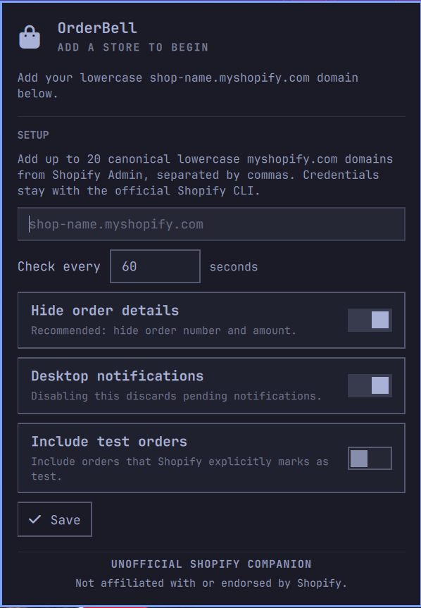

# OrderBell

OrderBell is an unofficial, read-only Omarchy plugin that checks Shopify for new orders, shows a compact status in the bar, and sends native desktop notifications. It is designed for merchants who want useful order awareness without putting a custom access token into a shell plugin.

> OrderBell is an independent community project. It is not affiliated with, endorsed by, or sponsored by Shopify. Shopify is a trademark of Shopify Inc. The plugin uses a generic shopping-bag icon and does not use Shopify brand assets.



## What version 0.1.0 does

- Polls one or more stores through the official Shopify CLI, using the GraphQL Admin API version `2026-07`.
- Requests only the `read_orders` scope.
- Establishes a quiet baseline on the first successful check, so installation does not replay historical orders as new.
- Requests a 30-second lifetime for native Omarchy notifications for up to five newly observed eligible orders in one poll; larger bursts are represented by count-only summaries so a catch-up cannot flood the desktop.
- Opens only a locally reconstructed Shopify Admin order page derived from the configured canonical store and numeric order ID.
- Keeps a bounded recent-order view and unread count in an Omarchy-native panel.
- Shows Shopify's sanitized shop name as the friendly label while retaining the canonical `*.myshopify.com` domain as the trusted identity and visible secondary context.
- Defaults to privacy mode, which omits the order name/number and amount from both the panel and notification history. Individual-order views retain store/status context; burst notifications contain only store and count regardless of this setting.
- Persists a per-store watermark and delivery state so bounded restart, suspend/resume, and temporary-network catch-up can reconcile without trusting missed timer ticks.

OrderBell does **not** edit orders, fulfill orders, manage themes, run an inbound server, install packages, collect telemetry, or send data to an OrderBell cloud service.

## Local polling, not a webhook service

The implemented `0.1.0` architecture is local polling. While the plugin is enabled and the desktop session is running, it checks each configured store every 60 seconds by default. A notification can therefore arrive up to one polling interval after Shopify records the order; it will wait longer while the notebook is asleep, offline, or logged out.

Each check starts the official Shopify CLI as a short-lived process. There is no permanent OrderBell worker, but CLI startup can create a brief CPU and memory burst. On a resource-sensitive notebook, increasing **Check every** to 120–300 seconds reduces that work proportionally in exchange for the same additional notification latency.

Each poll covers one explicit inclusive UTC window. Normal checks include a five-minute overlap; catch-up advances the durable watermark in chunks of at most six hours. A committed gap- or backward-clock-recovery chunk reports `catching_up` and asks the service to poll again after 60 seconds unless a notification-delivery problem takes precedence as `degraded`; the following ordinary current-time poll can return to `ok`. Every chunk is limited to 20 pages of 100 orders. OrderBell refuses to advance its watermark if Shopify indicates more data than that cap, or if the saved watermark is more than 59 days behind. This keeps the plugin inside Shopify's ordinary `read_orders` history boundary without requesting `read_all_orders`, but it also means very long outages or unusually dense six-hour windows require operator review rather than a silent best-effort skip.

A future real-time edition could use a separately deployed, authenticated webhook relay with HMAC verification, durable deduplication, and reconciliation polling. That relay is **not implemented, bundled, contacted, or required** by this release. See [Architecture](docs/ARCHITECTURE.md#future-webhook-relay-not-in-010).

## Requirements

- Omarchy 4 (Quattro) with the standard Omarchy shell and notifications service.
- Python 3.11 or newer; OrderBell uses only the Python standard library.
- The official Shopify CLI 4.0 or newer, available as `shopify` on `PATH`.
- A Shopify owner or staff account that can grant `read_orders` for each configured store.

OrderBell does not install or upgrade any of these dependencies. Install Shopify CLI only from Shopify's [official installation instructions](https://shopify.dev/docs/api/shopify-cli#installation), then verify its version:

```bash
shopify version
```

## Install

Fetch the current upstream checkout from the public repository without enabling it:

```bash
omarchy plugin add https://github.com/tbraxa/omarchy-orderbell.git --yes
git -C "$HOME/.config/omarchy/plugins/io.github.tbraxa.orderbell" rev-parse HEAD
omarchy plugin validate "$HOME/.config/omarchy/plugins/io.github.tbraxa.orderbell"
```

Here `--yes` accepts the non-interactive clone/add step; because `--enable` is omitted, the plugin remains disabled. This follows the repository's mutable default branch and is not by itself a commit-pinned or verified snapshot. Review the checkout and resolved commit, compare it with the marketplace's reviewed snapshot when available, and enable only the revision you accept:

```bash
omarchy plugin enable io.github.tbraxa.orderbell
```

Enabling a community plugin executes unsandboxed code as your desktop user. Marketplace verification, when available, applies to one reviewed commit and is not a general security guarantee.

## Authenticate with Shopify

OrderBell's panel can start authentication for a configured store. The worker launches the official Shopify CLI, which owns the browser/PKCE flow; OrderBell captures only its bounded result and reduces failures to a sanitized status. The transparent terminal fallback is below. Replace the example domain with the canonical domain shown in Shopify Admin under **Settings → Domains**:

```bash
shopify store auth \
  --store northwind.myshopify.com \
  --scopes read_orders
```

OrderBell requests and uses exactly `read_orders`. Shopify CLI can preserve or merge scopes already present in its stored session; running this command is not proof that unrelated earlier grants were removed. Review the approval/session carefully and revoke or re-authenticate through Shopify's current supported process if you require a strictly least-privilege session. OrderBell never needs a write scope, `read_reports`, or `read_all_orders`.

Shopify CLI stores an online access token for later `shopify store execute` commands. OrderBell invokes those commands but never reads, copies, prints, or persists the token itself, and it never invokes Shopify CLI with `--verbose`. The CLI credential is still accessible to Shopify CLI—and potentially to other software running as your Linux user—so protect the user account and audit other unsandboxed plugins. See [Security](SECURITY.md#shopify-cli-credential-boundary).

## Configure

Open OrderBell from the bar. A fresh installation shows its native **Setup** form immediately; later, use the **Settings** button in the panel. Enter one or more comma-separated canonical domains and press **Save**:

```text
northwind.myshopify.com, southridge.myshopify.com
```

Only lowercase `*.myshopify.com` hostnames are accepted. OrderBell rejects schemes, paths, query strings, fragments, user information, ports, IP addresses, uppercase aliases, and custom storefront domains.

The equivalent Omarchy commands are useful for recovery or scripted setup:

```bash
omarchy bar set io.github.tbraxa.orderbell stores northwind.myshopify.com
omarchy bar set io.github.tbraxa.orderbell refreshIntervalSec 60 --json
omarchy bar set io.github.tbraxa.orderbell privacyMode true --json
omarchy bar set io.github.tbraxa.orderbell includeTestOrders false --json
omarchy bar set io.github.tbraxa.orderbell notify true --json
```

The panel writes these same non-secret values through Omarchy's native bar configuration API. It does not write Shopify credentials.

| Setting | Default | Meaning |
| --- | ---: | --- |
| Stores | empty | Comma-separated canonical `*.myshopify.com` domains. |
| Check every | 60 seconds | Polling interval, clamped to 60–3600 seconds. |
| Hide order details | on | Hide order name/number and amount in the panel and per-order notifications; keep store and statuses visible. Burst notifications always use only store and count. |
| Include test orders | off | Include Shopify test orders in the panel, unread count, and notifications. On the next poll, switching this off durably removes retained test rows, their tracked unread contribution, and queued test notifications before Shopify is contacted. |
| Desktop notifications | on | Request a 30-second lifetime for each alert after the initial baseline. Omarchy, DND, dismissal, or an action can shorten or suppress visible display. On the next poll, switching this off durably clears the notification queue before Shopify is contacted. |

The first successful poll for each store intentionally produces no historical notifications. **Send test notification** in Settings verifies the local Omarchy alert path without contacting Shopify or creating an order. A genuine later order is still the only complete live check of polling, reconciliation, and delivery; OrderBell never creates or modifies an order for testing. If an authorized Shopify development store is used, enable **Include test orders** for Shopify-marked test orders to appear.

## Security and privacy at a glance

- All Shopify reads go through `shopify store execute`; mutations remain disabled and OrderBell never passes `--allow-mutations`.
- Store input is validated before it can reach a subprocess or URL.
- Subprocesses receive fixed argument arrays. There is no shell evaluation.
- Shopify JSON is treated as hostile, size-bounded, type-checked, and sanitized before display.
- The Shopify shop name is normalized, stripped of control/format characters, capped at 64 Unicode code points, and required to remain consistent across every page in a poll. It is presentation text only and never influences a subprocess argument or URL.
- Polling uses inclusive bounded windows: the checkpoint advances by at most six hours per catch-up poll while replaying a five-minute overlap. Each window is capped at 20 × 100 results and automatic catch-up at 59 days. Incomplete or over-limit windows never advance the watermark.
- The durable notification queue is capped at 64 entries, large bursts are summarized, and at most five delivery commands are attempted per worker run.
- Customer names, email addresses, phone numbers, addresses, notes, line items, raw API responses, and raw CLI errors are neither displayed nor persisted. Privacy mode additionally hides order name/number and amount from the panel and notifications.
- State and runtime directories are owner-only; state writes are atomic and symlink targets are refused.
- There is no OrderBell account, analytics, telemetry, advertising identifier, inbound port, or third-party backend.

The complete controls and residual risks are documented in [SECURITY.md](SECURITY.md), [PRIVACY.md](PRIVACY.md), and the [threat model](docs/THREAT_MODEL.md).

## Local data

Omarchy stores non-secret plugin settings in its normal shell configuration. OrderBell keeps minimal per-store state below:

```text
${XDG_STATE_HOME:-$HOME/.local/state}/orderbell/
```

Runtime locks live below `${XDG_RUNTIME_DIR}/orderbell/` and normally disappear with the login session. Canonical store domains are represented in filenames by SHA-256 hashes; the owner-only state also retains Shopify's sanitized shop name for friendly local display. See the exact field-level [data map](docs/DATA_MAP.md).

## Update, disable, and remove

Review the upstream diff first, then update and restart the shell immediately:

```bash
omarchy plugin update io.github.tbraxa.orderbell && omarchy restart shell
```

An enabled multi-file update can briefly pair an older in-memory model with a newly written worker; OrderBell rejects an incompatible response shape instead of accepting ambiguous state. The immediate restart then loads the QML components, imported JavaScript model, and worker from one revision. It does not clear OrderBell's durable state, bar settings, placement, or Shopify CLI authentication. If the update command fails, do not ignore it or enable a different revision blindly; inspect the checkout before restarting.

Temporarily stop polling and unload the plugin:

```bash
omarchy plugin disable io.github.tbraxa.orderbell
```

On current Omarchy 4, disabling a bar-widget plugin removes its bar placement and per-widget settings. OrderBell's durable state and Shopify CLI authentication remain, but record the non-secret settings first if you intend to re-enable it. Re-enabling starts with the manifest defaults and requires configuration again.

Remove the installed plugin:

```bash
omarchy plugin remove io.github.tbraxa.orderbell
```

Omarchy removes the plugin code and its bar placement. OrderBell deliberately does not run an uninstall script and does not delete state behind your back. After removal, you can inspect and delete the narrow `orderbell` state directory shown above with your file manager. Shopify CLI authentication is managed separately by Shopify CLI; removing OrderBell does not revoke or delete it.

## Troubleshooting

1. Confirm the dependency version with `shopify version` and confirm that Shopify CLI came from Shopify's official distribution.
2. Re-run `shopify store auth --store STORE.myshopify.com --scopes read_orders` if authentication has expired or the scope is wrong.
3. Confirm the configured value is the lowercase canonical `*.myshopify.com` hostname—not the public storefront domain or an Admin URL.
4. Open the OrderBell panel. It distinguishes authentication, throttling, malformed-response, timeout, offline, and local-state failures without showing raw CLI output.
5. If an unread badge appears but the toast was missed, the order was retained: open the panel, or replay recent Omarchy notifications with <kbd>Super</kbd>+<kbd>Shift</kbd>+<kbd>Alt</kbd>+<kbd>,</kbd>. DND is respected and never bypassed by OrderBell.
6. If the panel reports that catch-up is too old or too dense, do not repeatedly re-authenticate: OrderBell has deliberately preserved its prior checkpoint. Review the documented 59-day and 2,000-order-per-window limits before choosing a recovery path.
7. Validate a checkout before installation with `omarchy plugin validate /path/to/omarchy-orderbell`.

Do not use `shopify ... --verbose` while collecting a report; Shopify documents that verbose output may include sensitive data. Before filing a public issue, remove store domains, order numbers, amounts, timestamps, paths containing your username, and any authentication material.

### Recover damaged local state

Use this only when the panel explicitly reports corrupt local state. Recovery intentionally starts a new quiet baseline, so orders already present at the next successful poll will not be announced as new. OrderBell never deletes the damaged file automatically.

First copy the complete comma-separated **Stores** value from OrderBell Settings. The sequence below temporarily clears that value and restarts the shell, which stops polling without removing the widget's other settings or placement. It then moves only the affected store's validated, owner-only state file to a private backup and restores the full store list. Enter the list without spaces and run the commands as your normal desktop user:

```bash
(
  set -euo pipefail
  read -r -p "Current full Stores value: " orderbell_stores
  read -r -p "Canonical store domain: " orderbell_store
  IFS=',' read -r -a orderbell_store_items <<< "$orderbell_stores"
  [[ ${#orderbell_store_items[@]} -gt 0 ]]
  orderbell_found=0
  for orderbell_item in "${orderbell_store_items[@]}"; do
    orderbell_label="${orderbell_item%.myshopify.com}"
    [[ "$orderbell_item" == "$orderbell_label.myshopify.com" ]]
    [[ "$orderbell_label" =~ ^[a-z0-9]$ || "$orderbell_label" =~ ^[a-z0-9][a-z0-9-]{0,61}[a-z0-9]$ ]]
    [[ "$orderbell_item" != "$orderbell_store" ]] || orderbell_found=1
  done
  [[ $orderbell_found -eq 1 ]]
  orderbell_key=$(printf '%s' "$orderbell_store" | sha256sum | cut -d' ' -f1)
  orderbell_state_root="${XDG_STATE_HOME:-$HOME/.local/state}/orderbell/stores"
  orderbell_source="$orderbell_state_root/$orderbell_key.json"
  orderbell_backup="$orderbell_source.recovery-$(date -u +%Y%m%dT%H%M%SZ)"
  [[ -d "$orderbell_state_root" && ! -L "$orderbell_state_root" ]]
  [[ -f "$orderbell_source" && ! -L "$orderbell_source" ]]
  [[ $(stat -c '%a' -- "$orderbell_source") == 600 ]]
  [[ $(stat -c '%u' -- "$orderbell_source") == $(id -u) ]]
  [[ ! -e "$orderbell_backup" && ! -L "$orderbell_backup" ]]
  omarchy bar set io.github.tbraxa.orderbell stores ""
  omarchy restart shell
  mv -- "$orderbell_source" "$orderbell_backup"
  omarchy bar set io.github.tbraxa.orderbell stores "$orderbell_stores"
)
```

Keep the `0600` backup private until the new baseline is healthy; it can contain the same bounded commercial metadata as normal OrderBell state. If a command fails after polling is stopped, the subshell leaves **Stores** empty rather than resuming ambiguously; restore the recorded value only after resolving the failure. If the source file is absent or the domain is uncertain, stop rather than moving another file. The next successful poll for the recovered store creates a quiet baseline.

## Development and assurance

The implementation, review boundaries, and release gates are intentionally public:

- [Architecture](docs/ARCHITECTURE.md)
- [Worker protocol](docs/WORKER_PROTOCOL.md)
- [Threat model](docs/THREAT_MODEL.md)
- [Data map](docs/DATA_MAP.md)
- [Test plan](docs/TEST_PLAN.md)
- [Release checklist](docs/RELEASE_CHECKLIST.md)
- [0.1.0 release evidence](docs/RELEASE_EVIDENCE_0.1.0.md)
- [Contributing](CONTRIBUTING.md)

CI uses deterministic fakes and fixtures. It does not authenticate to Shopify or create an order. The release evidence separately records the authorized, read-only live-store observations and their limits without publishing store or order data.

## License

[MIT](LICENSE). Shopify names and marks remain the property of their respective owners.
